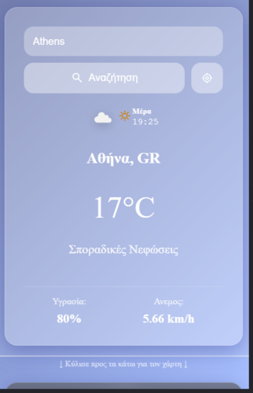
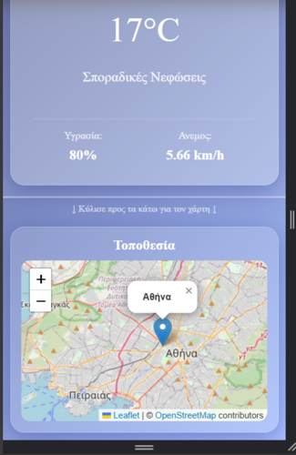
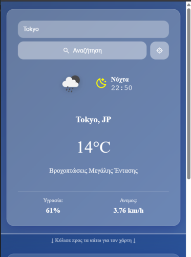

# 🌤️ Glass Weather App

<h2>📋 Project Overview</h2>

A beautiful, responsive weather application with glassmorphism design and interactive maps, built with modern web technologies.

<h2>🎯 Features</h2>

- **🌍 Real-time Weather Data** - Current conditions for any city worldwide
- **🗺️ Interactive Maps** - Location visualization with Leaflet.js  
- **📱 Responsive Design** - Perfect on desktop and mobile devices
- **🎨 Glassmorphism UI** - Modern glass-like design effects
- **📍 Geolocation** - Automatic detection of your current location
- **🌅 Dynamic Backgrounds** - Changes based on weather and time of day
- **⏰ Live Time Display** - Local time for each city with day/night indicators

<h2>🚀 Live Demo</h2>

[🔗 View Live Demo](https://davisdimos.github.io/weather-app/)

<h2>🛠️ Technologies Used</h2>

- **Frontend**: HTML5, CSS3, JavaScript (ES6+)
- **APIs**: OpenWeatherMap API, Leaflet.js Maps
- **Icons**: Custom SVG Icons
- **Styling**: Glassmorphism CSS Effects
- **Responsive**: Mobile-First Design

<h2>📦 Installation & Setup</h2>

1. **Clone the repository**
   ```bash
   git clone https://github.com/DavisDimos/weather-app.git
   ```

2. **Get your API Key**
   - Sign up at [OpenWeatherMap](https://openweathermap.org/api)
   - Get your free API key
   - Add it to `file_js/weather-api.js`:
   ```javascript
   const API_KEY = 'your-api-key-here';
   ```

3. **Open the application**
   - Open `index.html` in your browser
   - Or use a local server

<h2>🏗️ Project Structure</h2>

```
weather-app/
├── index.html                 # Main HTML file
├── README.md                  # Project documentation
├── css/
│   ├── style.css              # Base styles and reset
│   └── glassmorphism.css      # Glassmorphism effects & responsive design
├── file_js/
│   ├── app.js                 # Main application logic
│   └── weather-api.js         # API integration
└── pictures/
    ├──icons/                  # SVG icons
    │   ├── sun.svg
    │   ├── moon.svg
    │   ├── location.svg
    │   └── search.svg
    └── screenshots/           # Screenshots for README.md
        ├──Athens.png
        ├──minimize_window.png
        ├──mobile.png
        ├──mobile_1.png
        └──Tokyo.png
        

```

<h2>🎮 How to Use</h2>

1. **Search for a City**: Type any city name in the search bar
2. **Use Your Location**: Click the location button for automatic detection  
3. **View Weather Details**: See temperature, humidity, wind speed, and conditions
4. **Explore on Map**: Check the city location on the interactive map
5. **Mobile Experience**: Scroll vertically to see all information

<h2>📸 Screenshots</h2>

### Desktop View


### Mobile View  



### Minimize Window


<h2>🔧 API Reference</h2>

This project uses the [OpenWeatherMap API](https://openweathermap.org/api) for real-time weather data and geocoding services.

<h2>📄 License</h2>

This project is open source and available under the MIT License.

---
